# RouteScope 架构设计

## 1. 项目目标

RouteScope 是一个部署在 Linux 软路由上的网络流量观测与统计工具。

核心用户是个人网络管理员。产品帮助用户回答两个问题：哪些设备正在消耗带宽，以及这些设备的流量主要访问了哪些域名或网站。

### 1.1 首版目标

- 按设备统计上下行流量；
- 按连接（五元组）统计流量、协议、端口与会话时间；
- 关联 LAN 设备、NAT 会话与公网目标；
- 通过本地 DNS 代理关联设备、域名与 IP；
- 提供实时数据和分钟级历史统计；
- 为后续 XDP、高速网卡、OpenWrt 实机部署保留扩展空间。

默认不采集、不保存原始网络包和 HTTPS 内容，仅保存流量元数据与聚合统计。

### 1.2 首版范围与非目标

首版是只读观测产品，提供实时视图、历史查询和设备/域名 Top 统计；不提供限流、阻断、告警或自动化策略执行。

首版网络范围限定为 IPv4 LAN 经 NAT 访问单 WAN 的常见家庭网络。IPv6、PPPoE 与多 WAN 不作为首版验收条件，但数据模型和接口命名不得假定它们永远不存在。

设备身份以 MAC 地址为稳定主键；DHCP 租约、ARP 记录和主机名仅用于展示名称。界面应支持用户为设备设置手动名称，IP 地址变化不得生成新的设备记录。

### 1.3 后续限流演进

限流是后续功能，不进入首版数据路径。首版应在设备身份和统计查询之上预留策略接口：策略目标为设备、方向和速率上限，执行层可由 TC 或 nftables 实现。策略控制面必须与采集和历史查询服务分离，以免控制失败影响观测。

## 2. 技术选型

```text
目标系统：OpenWrt / Linux
开发环境：阿里云 Ubuntu 26.04，2 vCPU / 8 GiB RAM
目标规模：5–30 台设备，最高 1 Gbps 家庭接入
数据面：TC eBPF
网络控制面：nftables + conntrack
域名归因：本地 DNS 代理
存储：SQLite（首版）
服务端：Rust
eBPF 程序：C + libbpf + CO-RE
```

不在首版引入 XDP、VPP 或流量控制策略执行。

原因：

- TC eBPF 可同时覆盖 ingress 和 egress，更适合双向统计；
- 可以更自然地结合 Linux 路由、NAT、nftables 和 conntrack；
- XDP 更适合极高性能的早期入站包处理，缺少连接和 NAT 上下文；
- VPP 适合高吞吐专用数据平面，但会增加与 Linux 网络栈整合的复杂度。

## 3. 生产拓扑

```mermaid
flowchart LR
    UPSTREAM["上游网络 / 光猫<br/>互联网"]
    WAN_IF["WAN 接口<br/>eth0"]
    LAN_IF["LAN 接口<br/>br-lan"]
    CLIENTS["终端设备 / AP / 交换机<br/>IPv4 LAN"]

    UPSTREAM <--> WAN_IF
    CLIENTS <--> LAN_IF

    subgraph GATEWAY["RouteScope 网关"]
        direction TB

        subgraph DATAPLANE["Linux 数据面：双向转发与观测"]
            direction TB

            subgraph UPLOAD["上行路径：LAN → WAN"]
                direction LR
                LAN_IN["LAN ingress<br/>TC eBPF 计费点"]
                U_META["提取 LAN 侧原始元数据<br/>client MAC/IP:port、目标 IP:port<br/>协议、报文长度、时间戳"]
                U_ROUTE["Linux 路由与转发<br/>选择 WAN 出口"]
                U_CT["conntrack 查找 / 创建<br/>记录 TCP/UDP 连接状态"]
                U_FW["nftables forward<br/>按规则放行 / 丢弃"]
                U_SNAT["nftables NAT<br/>SNAT：私网源地址 → 公网源地址"]
                WAN_OUT["WAN egress<br/>仅用于转发 / NAT"]
                U_POST["提取 WAN 侧 NAT 后元数据<br/>由 conntrack 旁路关联"]

                LAN_IN --> U_META --> U_ROUTE --> U_CT --> U_FW --> U_SNAT --> WAN_OUT --> U_POST
            end

            subgraph DOWNLOAD["下行路径：WAN → LAN"]
                direction LR
                WAN_IN["WAN ingress<br/>仅用于转发 / NAT"]
                D_META["提取 WAN 侧 NAT 后元数据<br/>由 conntrack 旁路关联"]
                D_CT["conntrack 反向查找<br/>恢复原始连接与 NAT 映射"]
                D_DNAT["nftables NAT<br/>反向 DNAT：公网目标 → LAN 客户端"]
                D_ROUTE["Linux 路由与转发<br/>选择 LAN 出口"]
                D_FW["nftables forward<br/>按规则放行 / 丢弃"]
                LAN_OUT["LAN egress<br/>TC eBPF 计费点"]
                D_POST["提取 LAN 侧还原后元数据<br/>client MAC/IP:port、LAN 接口"]

                WAN_IN --> D_META --> D_CT --> D_DNAT --> D_ROUTE --> D_FW --> LAN_OUT --> D_POST
            end
        end

        subgraph DNS["DNS 域名归因链路"]
            direction LR
            DNS_MATCH["DNS 识别 / redirect<br/>nftables：UDP/TCP 53"]
            DNS_PROXY["本地 DNS 代理<br/>按客户端接收与转发查询"]
            DNS_UP["上游 DNS resolver"]
            DNS_CACHE["短期关联缓存<br/>client IP/MAC → domain → target IP<br/>TTL、时间窗、source、confidence"]

            DNS_MATCH --> DNS_PROXY
            DNS_PROXY -->|查询| DNS_UP
            DNS_UP -->|响应| DNS_PROXY
            DNS_PROXY --> DNS_CACHE
        end

        subgraph OBSERVABILITY["用户态采集、归因与存储"]
            direction TB
            BPF_MAPS["LAN TC eBPF maps<br/>双向 per-flow counters<br/>按 skb->len 计费"]
            EVENT_PIPE["观测数据读取<br/>周期性读取 map / 统计快照<br/>不保存原始网络包"]
            CT_EXPORT["conntrack netlink snapshot<br/>NAT 前后映射、connection_state"]
            COLLECTOR["Rust collector<br/>校验 Flow、关联 NAT 与状态"]
            DEVICE_ID["设备身份解析<br/>MAC 为稳定主键<br/>DHCP / ARP / 手动名称"]
            FLOW_AGG["双向 Flow 聚合器<br/>五元组、上下行计数、NAT 映射<br/>字节数、包数、首末时间"]
            DOMAIN_JOIN["域名关联器<br/>按 client + target IP + TTL<br/>记录 domain_source / confidence"]
            REALTIME["实时统计视图<br/>设备 / Flow / 域名 Top"]
            SQLITE["SQLite 持久化<br/>Flow 连接明细：24h<br/>设备 / 域名分钟聚合：30d"]
            API["观测只读 API / Web UI<br/>设备、Flow、域名 Top 查询<br/>设备名称管理"]

            BPF_MAPS --> EVENT_PIPE --> COLLECTOR
            CT_EXPORT --> COLLECTOR
            COLLECTOR --> DEVICE_ID --> FLOW_AGG --> DOMAIN_JOIN
            DOMAIN_JOIN --> REALTIME
            DOMAIN_JOIN --> SQLITE
            REALTIME --> API
            SQLITE --> API
        end
    end

    WAN_IF --> WAN_IN
    WAN_OUT --> WAN_IF
    LAN_IF --> LAN_IN
    LAN_OUT --> LAN_IF

    U_META -.->|LAN upload 计费| BPF_MAPS
    D_POST -.->|LAN download 计费| BPF_MAPS
    U_CT -.->|状态 / NAT| CT_EXPORT
    D_CT -.->|状态 / NAT| CT_EXPORT

    LAN_IN -.->|DNS 请求| DNS_MATCH
    DNS_PROXY -.->|DNS 响应回 LAN| LAN_OUT
    DNS_CACHE --> DOMAIN_JOIN
    API -.->|管理面仅允许 LAN 访问| LAN_IF

    classDef edge fill:#eaf2ff,stroke:#4472c4,color:#123;
    classDef hook fill:#fff2cc,stroke:#bf9000,color:#000;
    classDef process fill:#e2f0d9,stroke:#70ad47,color:#000;
    classDef side fill:#f4f4f4,stroke:#777,color:#222;
    classDef storage fill:#fce4d6,stroke:#c55a11,color:#000;

    class UPSTREAM,WAN_IF,LAN_IF,CLIENTS edge;
    class LAN_IN,LAN_OUT hook;
    class U_META,U_ROUTE,U_CT,U_FW,U_SNAT,U_POST,D_META,D_CT,D_DNAT,D_ROUTE,D_FW,D_POST process;
    class BPF_MAPS,EVENT_PIPE,CT_EXPORT,COLLECTOR,DEVICE_ID,FLOW_AGG,DOMAIN_JOIN,REALTIME,API process;
    class DNS_MATCH,DNS_PROXY,DNS_UP,DNS_CACHE side;
    class SQLITE storage;
```



软路由必须位于 LAN 与 WAN 之间，以确保客户端流量经过观测点。

## 4. 数据采集架构

LAN 接口是唯一计费点：TC eBPF 在 ingress/egress 按 `skb->len` 累计双向字节，WAN 侧不重复计费。conntrack 与 DNS 只做旁路关联，不参与字节统计。

```text
LAN 接口（唯一计费点）
   │
   ├── TC eBPF ingress / egress
   │      ├── 客户端视角五元组、MAC、协议、接口
   │      ├── 按 skb->len 写入 per-flow map（上下行独立计数）
   │      └── 用户态周期性读取 map 快照（不保存原始报文）
   │
   ├── conntrack netlink（旁路）
   │      └── 只读快照：NAT 前后映射、connection_state → 补齐 Flow
   │
   ├── DNS 代理（旁路，可选）
   │      └── client IP/MAC → domain → target IP（TTL / 置信度）
   │
   └── Rust collector / 观测服务
          ├── 校验 Flow、关联 NAT 与连接状态
          ├── 设备识别：MAC 主键；DHCP / ARP / 手动名称仅作展示
          ├── 双向 Flow 聚合与域名关联
          ├── 实时统计视图
          ├── SQLite：Flow 明细 24h；设备 / 域名分钟聚合 30d
          └── 只读 API / Web UI（仅管理网或 LAN）
```

## 5. 流量记录模型

每条 Flow 至少包含：

```text
flow_id
first_seen / last_seen
protocol
direction
lan_interface / wan_interface

client_mac
client_ip / client_port
destination_ip / destination_port

nat_source_ip / nat_source_port
nat_destination_ip / nat_destination_port

upload_bytes / download_bytes
packet_count
domain
domain_source
connection_state
```

其中 `client_mac` 是设备归因的稳定键；`client_ip` 是 Flow 建立时的地址快照。Flow 记录还应保留域名归因的置信度和关联时间，以便解释域名展示结果。

Flow 的 `direction` 固定为 `bidirectional`，上下行分别由独立计数器表达。计数方向以 LAN 设备视角定义：

- `upload`：LAN 客户端发送至 WAN；
- `download`：WAN 返回至 LAN 客户端。

TC eBPF 只在 LAN 侧累计字节，WAN 侧不重复计费；conntrack 只负责将原始 tuple 与转换后 tuple 关联。需要同时保留 NAT 前与 NAT 后的连接信息，避免多设备经过 NAT 后无法准确归因。

## 6. 域名归因

RouteScope 优先通过本地 DNS 代理获得域名关联：

1. 将 LAN 客户端 DNS 请求重定向到网关 DNS 代理；
2. 记录客户端、查询域名、返回 IP 与 TTL；
3. Flow 命中目标 IP 时，按客户端和有效期关联域名；
4. 可选解析 TLS/QUIC ClientHello 的 SNI 作为补充。

域名信息以尽力而为的方式呈现：

- `domain_source` 至少区分 DNS、SNI 与未知；
- `domain_confidence` 标记关联可靠程度，DNS 按客户端与 TTL 命中的记录可标为高，SNI 或共享 IP 推断应降低置信度；
- 无法可靠归因的连接显示为“未知”，不得猜测或伪装为精确网站访问记录；
- 设备域名 Top 以域名和字节数聚合，并保留来源与置信度供界面说明。

限制：

- DoH、DoT、VPN、代理和 ECH 可能导致域名不可见；
- CDN 可能让多个域名共用 IP；
- 域名关联应记录来源和置信度，不能将推测结果视作绝对准确。

## 7. 开发阶段网络命名空间拓扑

阿里云 Ubuntu 使用 Linux network namespace 与 veth 模拟完整网络：

```text
client-a namespace ─┐
                    ├── LAN veth ── router namespace ── WAN veth ── wan namespace
client-b namespace ─┘
```

- `client-a`、`client-b`：模拟不同 MAC/IP 的终端设备；
- `router`：运行 nftables、conntrack、DNS 代理、TC eBPF 与 RouteScope 服务；
- `wan`：模拟上游网络和测试服务端；
- 每个 namespace 通过 veth 连接，流量路径可控、可重复测试。

测试流量包括：

```bash
iperf3
curl
dig
HTTP/3 / QUIC 请求
TCP、UDP、DNS 与大流量双向传输
```

## 8. 开发与验证阶段

### 阶段一：Linux namespace 开发

验证：

- eBPF 程序加载与接口挂载；
- 客户端视角双向 Flow、上下行与字节统计；
- conntrack NAT 前后 tuple、连接状态与 Flow 关联；
- 多客户端设备归因；
- DNS 域名关联；
- SQLite 聚合与 API 输出。

### 阶段二：OpenWrt 虚拟机验证

验证：

- OpenWrt 内核与 BPF 特性兼容；
- `tc`、nftables、conntrack 模块可用；
- 资源占用、启动流程与服务打包；
- 自定义 OpenWrt 镜像构建。

### 阶段三：双网口实机验证

验证：

- 真实网卡吞吐、丢包与 CPU 占用；
- 多设备并发流量；
- Wi-Fi AP 与 IPv4 NAT 的真实网络环境；
- 统计结果与接口实际字节数的误差；
- 是否需要引入 XDP、批量聚合或其他性能优化。

### 首版验收标准

- 在 5–30 台设备、最高 1 Gbps 的家庭网络目标下稳定运行；
- 设备上下行字节统计可与 LAN/WAN 接口计数进行核对，并记录统计口径和允许误差；
- 可查询每台设备最近 24 小时的连接明细，包括五元组、双向字节数、NAT 映射、连接状态和可用的域名归因；
- 可查看每台设备按流量排序的域名 Top，且未知或低置信度关联必须清晰标识；
- 可查询最近 30 天的分钟级设备和域名聚合趋势。

### 验收后的后续优先级

域名分钟趋势查询已经完成：API 可按设备与域名返回 30 天保留窗口内的原始分钟桶，
设备详情页提供 24 小时和 30 天趋势视图。

1. **P1：DNS 设备身份稳定关联**
   当前 DNS 缓存使用客户端 IP，需补充 IP 到 MAC 的快照关联，降低 DHCP 地址复用带来的错误归因风险。
2. **P1：Flow 查询分页和上限**
   当前设备 Flow 查询可能返回 24 小时内的全部记录，需要增加数据库 LIMIT、时间窗和分页游标。
3. **P2：延迟域名归因回填**
   DNS 观察晚于 Flow 写入时，之前已写入的字节不会回填到域名聚合，需要设计可幂等的归因更新和聚合修正。
4. **P2：敏感元数据主动删除**
   当前只有按时间保留期清理，仍需提供按设备、域名或数据范围删除的管理能力。

## 9. 性能演进策略

首版优先保证统计正确性和模块边界清晰：

```text
TC eBPF + conntrack + 用户态聚合
```

实机性能压测后按瓶颈优化：

1. 优化 BPF map 类型、key 设计与批量读取；
2. 减少用户态事件数量，采用周期性 map 聚合；
3. 按 CPU 分片，使用 per-CPU map；
4. 对高流量入口增加 XDP 预统计或采样；
5. 仅在明确需要极高吞吐时评估 VPP/DPDK。

## 10. 安全与隐私原则

- 默认不保存原始报文；
- 默认不解密 HTTPS；
- 管理 API 必须使用本地账户认证；
- 管理界面与 API 仅监听管理网或 LAN，不直接暴露至 WAN；
- Flow 连接明细保存 24 小时，随后删除；
- 设备和域名分钟级聚合保存 30 天，随后删除；
- 到期清理任务应定期执行、可观测且可安全重试；
- 对 MAC、IP、域名等敏感元数据提供删除能力；
- 所有 DNS/SNI 域名关联均标注数据来源与可信度。

## 11. 当前项目文件结构

当前代码已实现领域模型、SQLite 持久化、分钟聚合、观测只读 API、设备名称管理和可选模拟采集，
第一版 TC eBPF IPv4 TCP/UDP 双向 Flow 统计、只读 conntrack NAT 关联，以及可选
的本地 DNS UDP/TCP 转发和 IPv4 A 记录域名归因；本地管理员账户认证、会话和 CSRF
防护也已落地。域名分钟聚合可通过 API 查询，并在 htop 风格设备详情页中按 24 小时或
30 天窗口查看。

```text
.
├── Cargo.toml                  # Rust 包定义与依赖
├── Cargo.lock                  # 可复现的依赖版本
├── Makefile                    # run、check、test、fmt 开发命令
├── README.md                   # 项目状态与本地开发说明
├── .env.example                # 本地开发环境变量示例
├── config/
│   └── routescope.example.env  # 部署配置示例
├── docs/
│   └── architecture.md         # 产品边界与架构设计
├── src/
│   ├── main.rs                 # 服务启动、路由组装和路由测试
│   ├── api/
│   │   └── mod.rs              # 健康检查与受保护的只读 API 路由
│   ├── auth.rs                 # 本地账户、Argon2id、会话、CSRF 与限速
│   ├── collector.rs            # 真实采集接口与模拟采集器
│   ├── conntrack.rs            # conntrack netlink 快照与 NAT 关联
│   ├── dns.rs                  # DNS observation 队列、TTL 缓存与 Flow 域名归因
│   ├── dns_proxy.rs            # 本地 DNS UDP/TCP 转发与 A 记录解析
│   ├── routescope_tc.c         # TC eBPF IPv4 TCP/UDP 统计程序
│   ├── build.rs                # 编译 TC eBPF 对象文件
│   ├── config.rs               # 监听地址和保留期配置
│   ├── domain.rs               # Device、Flow、域名归因领域模型
│   ├── service.rs              # 观测查询、Flow 写入与清理
│   ├── storage.rs              # SQLite 仓储、聚合与清理
│   └── web.rs                  # 真实观测页面、设备命名和静态资源路由
├── scripts/
│   └── namespace_lab.sh        # namespace 拓扑与 NAT smoke test
├── templates/
│   ├── login.html              # 登录页面
│   ├── dashboard.html          # 设备概览与实时统计
│   ├── devices.html            # 设备列表与手动命名
│   └── device_detail.html      # Flow、趋势与域名 Top
└── static/
    └── app.css                 # 最小管理界面样式
```

服务默认仅监听 `127.0.0.1:8080`。`/healthz` 是进程存活检查，`/readyz` 会反映已启用
采集器是否已完成启动；运行中的采集失败会让就绪状态降级。管理页面和 `/api/v1/*` 均由本地会话认证中间件保护，
登录 POST/登出 POST/设备命名 POST 均要求 CSRF 校验。开发绕过只接受 loopback 监听地址。

SQLite 使用 `PRAGMA user_version` 记录 schema 版本。打开数据库时会在事务中执行尚未
应用的迁移，并启用 WAL、忙等待与 `synchronous=NORMAL`；Flow 批次使用单事务写入，
避免每条 Flow 单独获取锁和提交。

收到 SIGINT/SIGTERM 后，HTTP 服务进入优雅退出，采集、DNS 归因和保留期清理任务通过
共享 shutdown 信号停止。`ROUTESCOPE_SHUTDOWN_TIMEOUT_SECS` 控制等待 HTTP 连接的最长
时间。eBPF 构建默认根据 Cargo target 选择 `__TARGET_ARCH_*`，也可通过
`ROUTESCOPE_BPF_TARGET_ARCH` 显式覆盖。
